# Adaptive Multimodal Assistant! - Ollama

`Adaptive Multimodal Assistant` is a free AI chatbot crafted to facilitate local interactions with various LLMs, documents, and a range of advanced functionalities. It leverages the `Chainlit` Framework, along with Agents and Chains, to enhance the user experience.

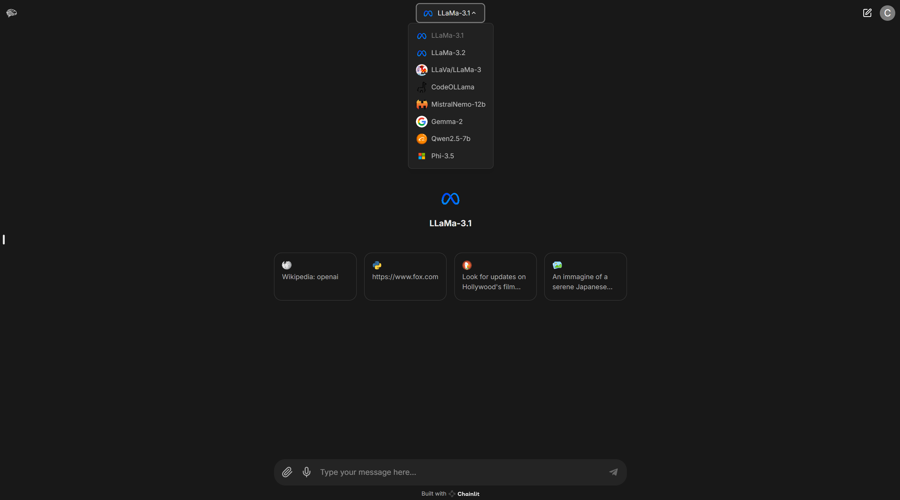

## Local LLMs 🔒

Harnessing models via `Langchain` and `ChatOllama`, hosted locally with `Ollama`, offers numerous benefits in terms of customization. This setup allows for tailored model configurations that align with specific project requirements, enabling developers to fine-tune performance and functionalities.
`Ollama server` will be running on the Kaggle notebook due to the limitation of storage and processors of local machines.

## Literalai cloud storage and observability ☁️👁️

`Literalai` provides seamless integration for data storage and observability, ensuring efficient management and monitoring of your AI model's performance. With built-in support for handling large datasets and real-time analytics, Literalai allows you to track, store, and visualize key metrics, offering deep insights into your models' behavior and outcomes. This robust storage system simplifies debugging and optimizes performance, making it a crucial tool for developing scalable AI applications.

## Key Features 🌟

1. **Chat with Documents** 📄  

   Interact with various document formats, including `PDF`, `TXT`, `.PY`, `DOCX`, `images` and `CSV` files, using a `Retrieval Augmented Generation` (RAG) approach.

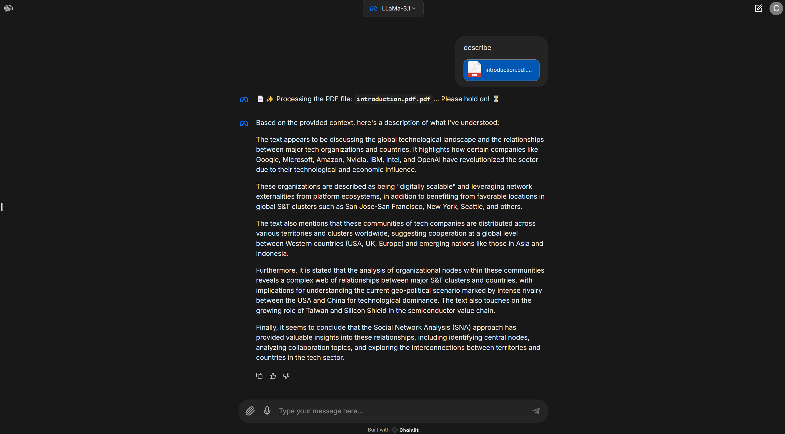
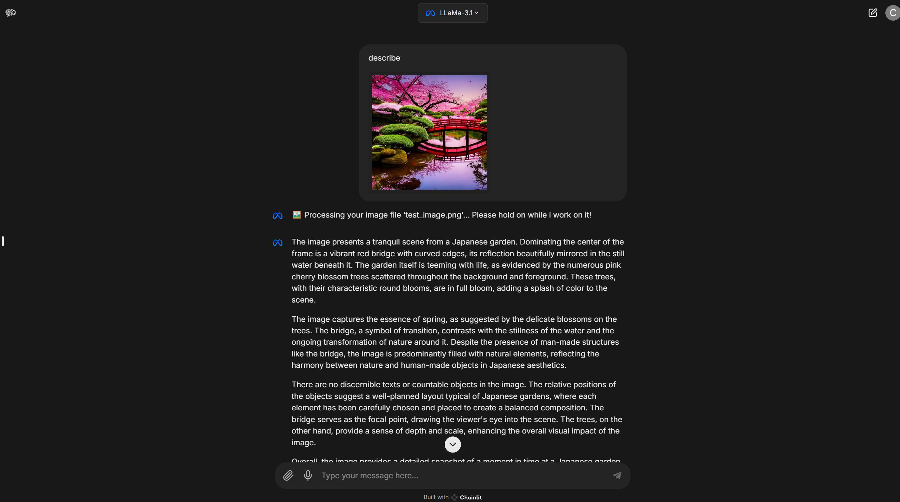
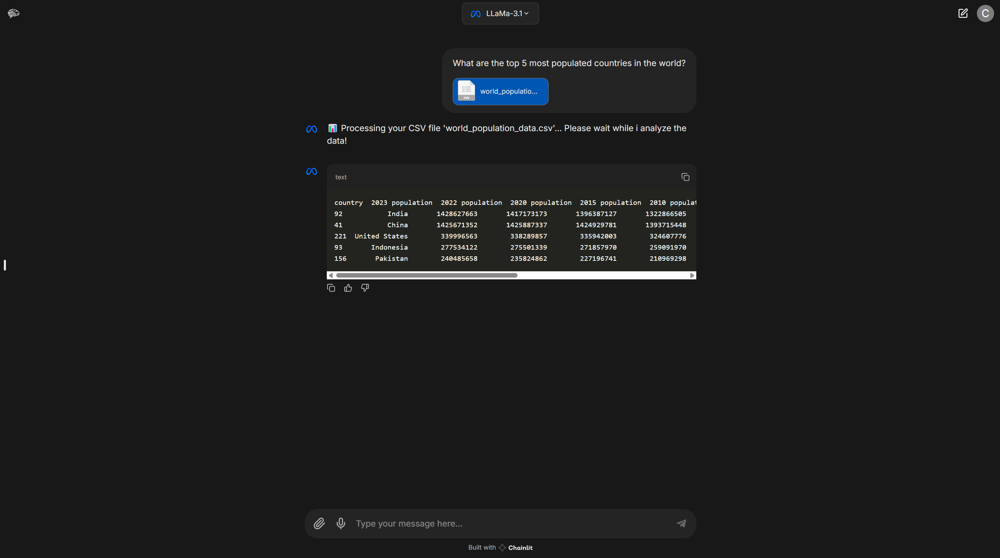


2. **Speech to Text and Text to Speech** 🗣️  
   
   Utilize multimodal capabilities of `speech-to-text` and `text-to-speech` to interact with the assistant via both text and audio.

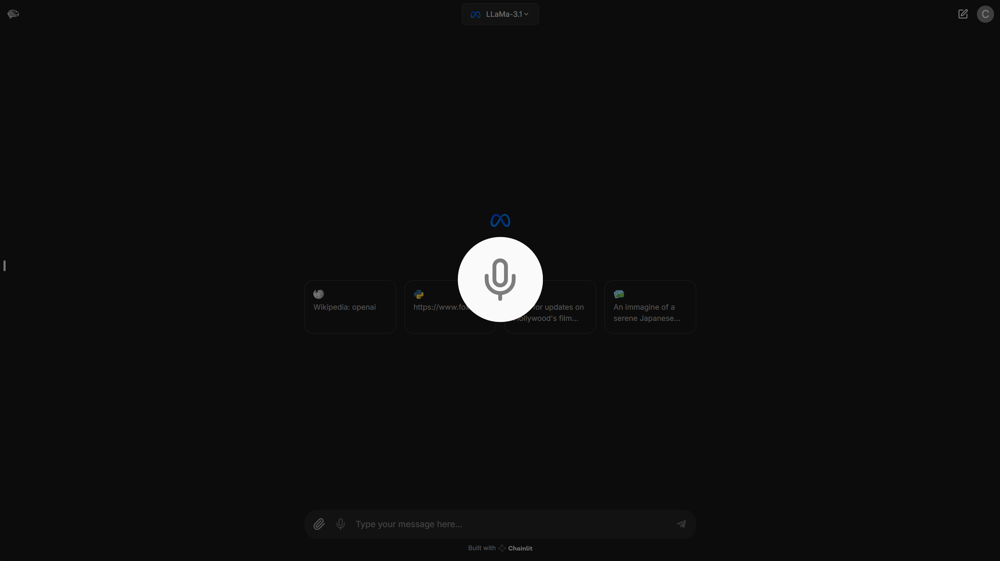

3. **Image Generation** 🖼️  
   
   Generate images locally using `StableDiffusion` with the **CompVis/stable-diffusion-v1-4** model, downloaded using the `diffusers` library.

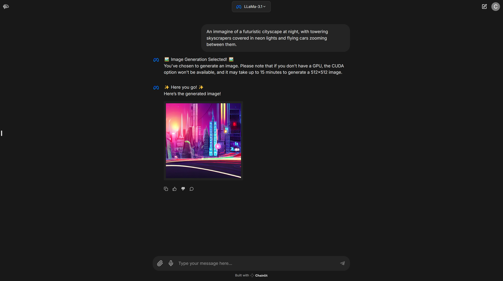

4. **Wikipedia Search** 🔍  
   
   Perform searches on `Wikipedia` by entering keywords after the first word of the command, which must be `Wikipedia` or `wikipedia`, to trigger the functionality.

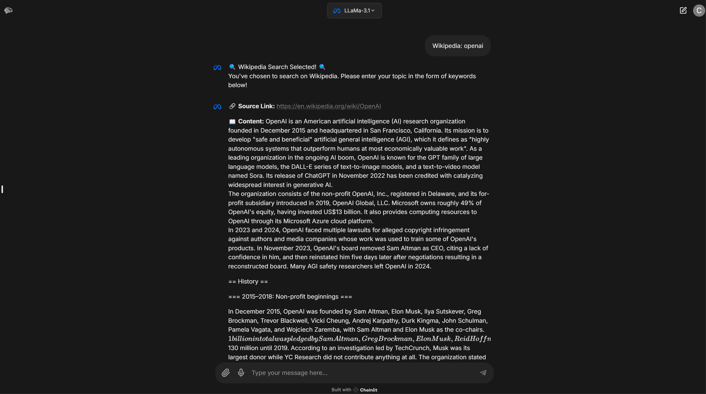

5. **HTML Web Page Scraper** 🌐  
   
   Extract HTML code from a Web Page using `BeautifulSoup`.

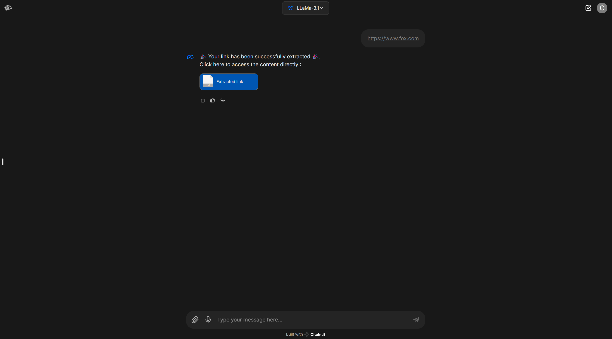

6. **DuckDuckGo Web  Search** 🔎  
   
   Conduct searches directly on the `DuckDuckGo` browser, returning the first 10 search results.

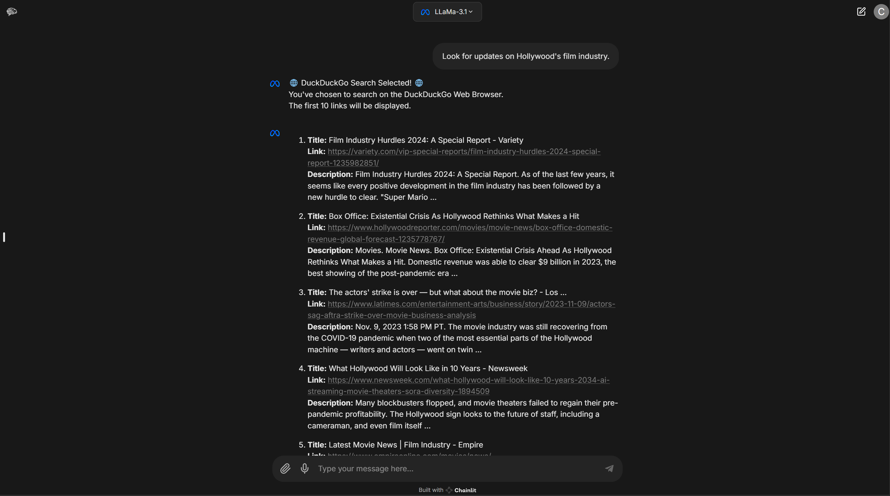

7. **Resume Chats** 💬🔄
   
   Users can effortlessly retrieve and continue previous chat sessions, ensuring a smooth conversation flow.

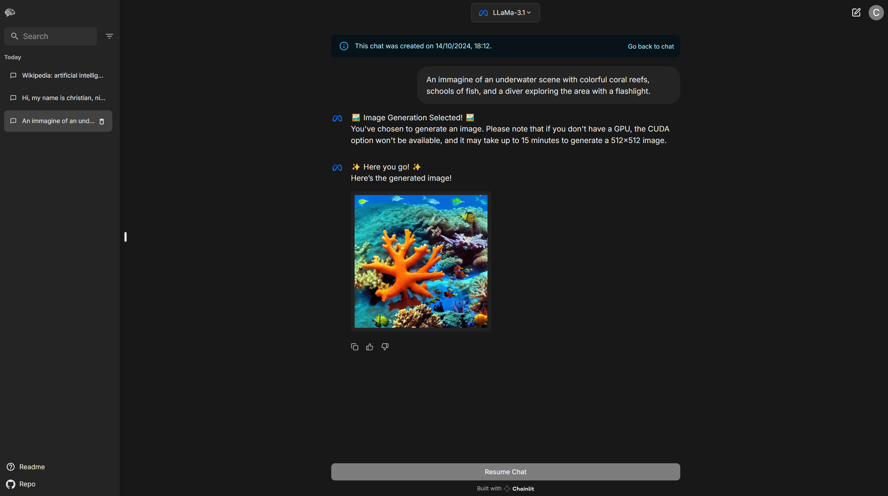

8. **Literal Ai Storage anche chats** ☁️👁️
   
   Integration with Literal AI enables efficient cloud storage of chat histories, allowing quick access to past interactions.

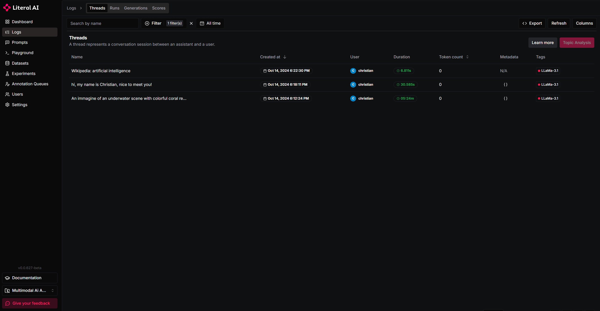
   
## Setup Instructions ⚙️

To get started, follow these simple steps:

1. **Install dependencies**  
   Install the required packages by running:  
   ```bash 
   pip install -r requirements.txt
   ```
3. **Download and Install Ollama**  
   Ollama is required for running models locally. Follow these instructions for your operating system:

   - **Windows/Linux/macOS**:  
   Visit the [Ollama Download Page](https://ollama.com/download) and follow the instructions to install Ollama on your machine.

   - Visit the Kaggle site. And run https://www.kaggle.com/code/teddybrown414/ollama-server-gpu
   - Copy the `ngrok` URL that the ollama server above gives you and open windows cmd.
   - Input `set OLLAMA_HOST=<ngrok URL you received>`
   - Check whether ollama server is running correctly by cmd `ollama list`

4. **Download Local LLM**  
   
   After installing Ollama, you will need to download the models. Use the following commands:

   - For Llama3.1:  
     ```bash 
     ollama pull llama3.1

   - For Llama3.2:  
     ```bash
     ollama pull llama3.2

   - For LLava:  
     ```bash
     ollama pull llava-llama3

   - For CodeOLLama:  
     ```bash
     ollama pull codellama:7b

   - Per MistralNemo-12b:  
     ```bash
     ollama pull mistral-nemo

   - Per Gemma-2:  
     ```bash
     ollama pull gemma2

   - Per Qwen2.5-7b:  
     ```bash
     ollama pull qwen2.5:7b

   - Per Phi-3.5:  
     ```bash
     ollama pull phi3.5

5. **Literal**

   To create an account on [Literal AI](https://literalai.com/), visit the website and click on **Sign Up**. After confirming your email, log in to the dashboard and create a new project by clicking on **Create Project**. Finally, navigate to **Settings**, locate the **API Keys** section, and click on **Generate API Key** to obtain your API key.


6. **Configure your environment**   
   
   Set up your Chainlit API by running the following command in your terminal:  
   ```bash
   chainlit create-secret
   ```

   Create a `.env` file in the root directory and add your previously created API keys:  
   
   `CHAINLIT_API_KEY=<YOUR_CHAINLIT_API_KEY>` 

   `LITERAL_API_KEY=<YOUR_LITERAL_API_KEY>`
   
   `BASE_URL=<ngrok URL>` - This is for ollama embedding and inference.

7.  **Run the application**  
    
      Start the assistant with:  

      ```python
      chainlit run app.py --port <YOUR_PORT>
      ```
      This will open the localhost page `localhost:<YOUR_PORT>`.
